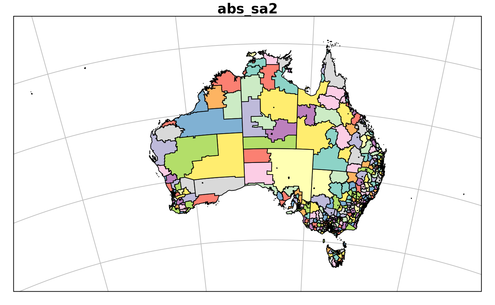
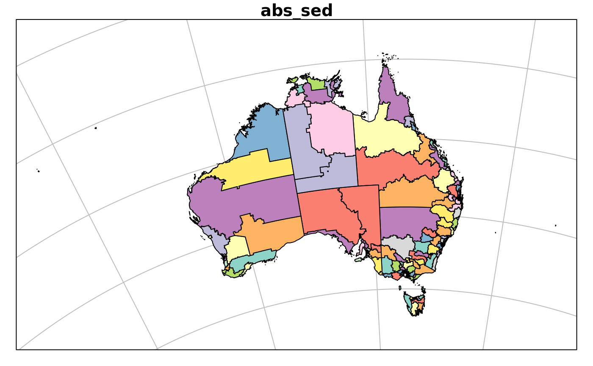
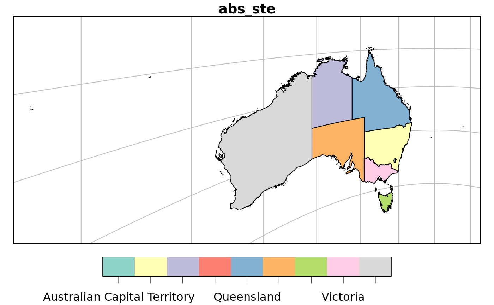

<!-- README.md is generated from README.Rmd. Please edit that file -->

# ozmaps.data

The goal of ozmaps.data is to provide reasonably detailed data sets for
various spatial subdivisions of Australia.

## Installation

The package is not on CRAN but you can install ozmaps.data with:

``` r
devtools::install_github("mdsumner/ozmaps.data")
```

## Example

Here we plot each available data
set.

``` r
LCC <- "+proj=lcc +lon_0=130 +lat_0=-20 +lat_1=-43 +lat_2=-10 +datum=WGS84"

library(ozmaps.data)
library(sf)
#> Linking to GEOS 3.6.2, GDAL 2.2.3, PROJ 4.9.3
library(ggplot2)
plot(abs_ced, main = "Commonwealth Electoral Divisions")
```


``` r
plot(st_transform(abs_gccsa, LCC), main = "Greater Capital City Statistical Areas", graticule = TRUE)
```


``` r
ggplot(abs_ireg, aes(fill = NAME)) + geom_sf() + guides(fill = FALSE) + coord_sf(crs = 3577)  + ggtitle("Indigenous Regions (EPSG:3577)")
```


``` r


## tmap with localized Local Government Area plus inset map for the state
library(tmap)
kbb <- st_bbox(dplyr::filter(abs_lga, stringr::str_detect(NAME, "Kingborough")))
k_lga <- abs_lga[unlist(st_intersects(st_as_sfc(kbb), abs_lga)), ]
#> although coordinates are longitude/latitude, st_intersects assumes that they are planar

kmap <- tm_shape(k_lga, bbox = kbb) +
  tm_polygons(col = "NAME")

library(grid)
kmap 
#> Legend labels were too wide. The labels have been resized to 0.45, 0.30, 0.41, 0.53, 0.36, 0.34. Increase legend.width (argument of tm_layout) to make the legend wider and therefore the labels larger.
tasmap <- tm_shape(abs_ste %>% dplyr::filter(NAME == "Tasmania")) +
  tm_polygons(col = "NAME", legend.show = FALSE) 
kregion <-   tm_shape(st_as_sfc(kbb)) + 
  tm_borders(lwd = 1) 

print(tasmap + kregion, vp = viewport(0.85, 0.27, width = 0.3, height = 0.5))
```


``` r


plot(abs_ra, main = "Regional Areas")
```


``` r


plot(abs_sa2, main = 'abs_sa2')
```



``` r
plot(abs_sa3, main = 'abs_sa3')
```


``` r
plot(abs_sa4, main = 'abs_sa4')
```


``` r
plot(abs_sed, main = 'abs_sed')
```



``` r
plot(abs_ste, main = 'abs_ste')
```



Please note that the ‘ozmaps.data’ project is released with a
[Contributor Code of Conduct](CODE_OF_CONDUCT.md). By contributing to
this project, you agree to abide by its terms.
